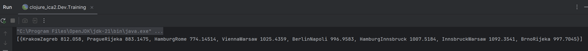
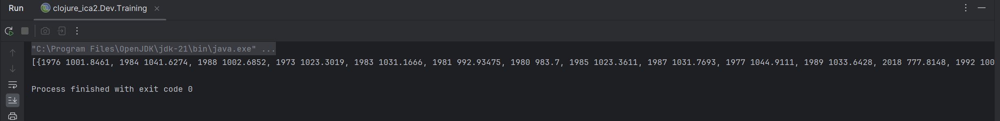
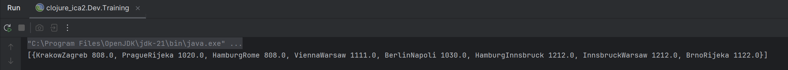
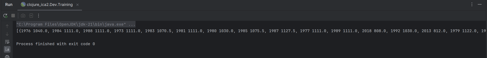

# TECHNICAL REPORT

# Intro

In prototyping the product architecture, the team focused on tips and ideas from the classic book "A Craftsman's Guide to Software Structure and Design" by Robert C. Martin

## How the algorithms was developed

### Dep/Des

When first analysing the training dataset, the authors concluded that the first place to start was to investigate possible pattern extraction based on the point of departure and arrival.

The idea of compiling the arithmetic mean price for AB/BA cities seemed reasonable, and after writing a script to automate the work with the data, we obtained a set of statistical data.

### Year of birth

The second stage we paid attention to the age of passengers. It is known that with age people's idea of money changes, and in order to confirm our hypothesis we decided to analyse passengers' age and price paid.

### Analysis of Names

Next, the authors turned their attention to the names of the passengers. Based on the term paper data, it is known that there are two groups of passengers - tourists and families.

The authors hypothesised that the most sensible way to separate these groups would be by testing their surnames, and if they all matched, then the passengers in question were families.

Having got the opportunity to conduct A/B testing, we started to check the dependence of the type of passenger group to the price modifier, applying which they are more willing to use the offered ticket purchase option.

### Median

In a further step, the authors decided to make the statistical analysis somewhat more complex and accurate, and updated the counting algorithms from arithmetic mean to median search.

(dep/des median values example, it's much accurate than the arithmetic mean results)

(years of birth median values)

# Wrong ideas

The authors also investigated two hypotheses that were not included in the final judgement.

The first of these is the dependence of price on the gender of the passenger, after testing, the authors found that the gender composition of passengers has no effect on the preferred price.

Second, combining the metrics of passenger's year of birth and departure and arrival cities into one metric. This hypothesis produced more interesting results than when the metrics were separated, but after discussion it was decided that this made the programme more effective only on a test dataset, and in more extensive testing the results were worse than before.